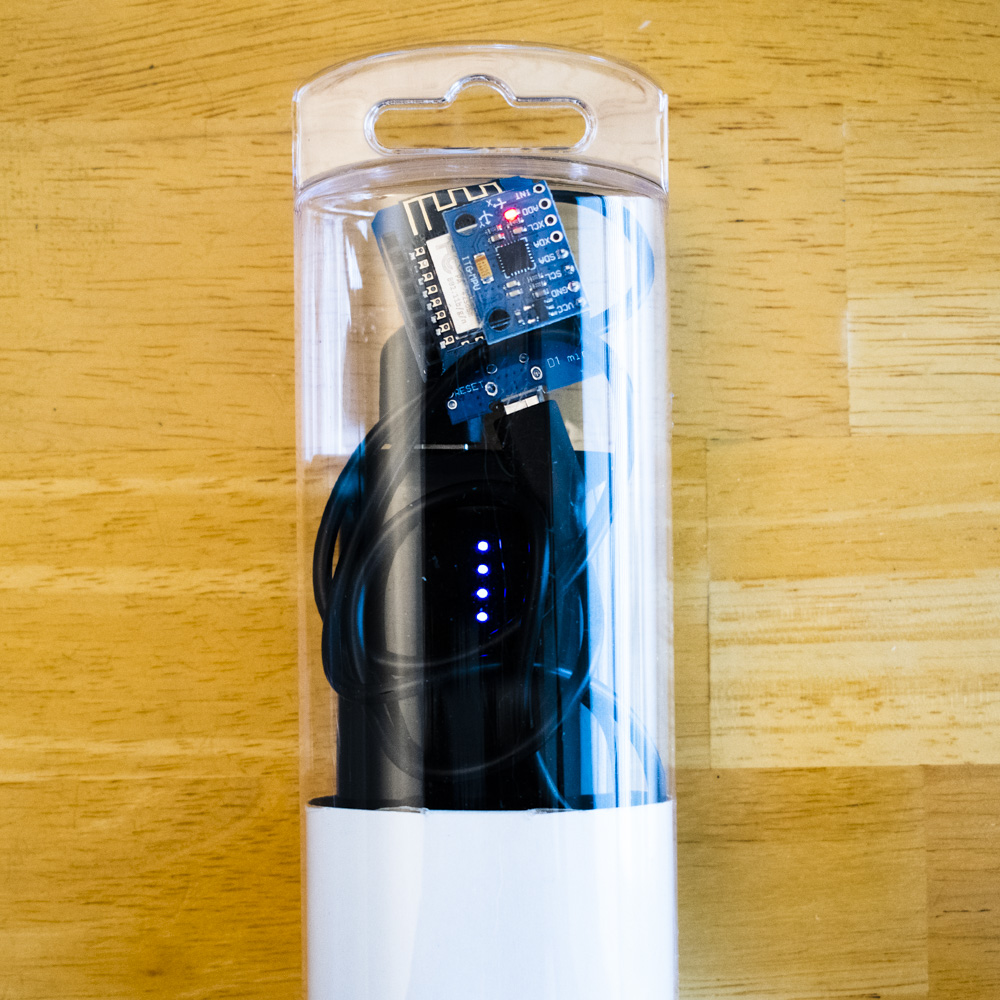
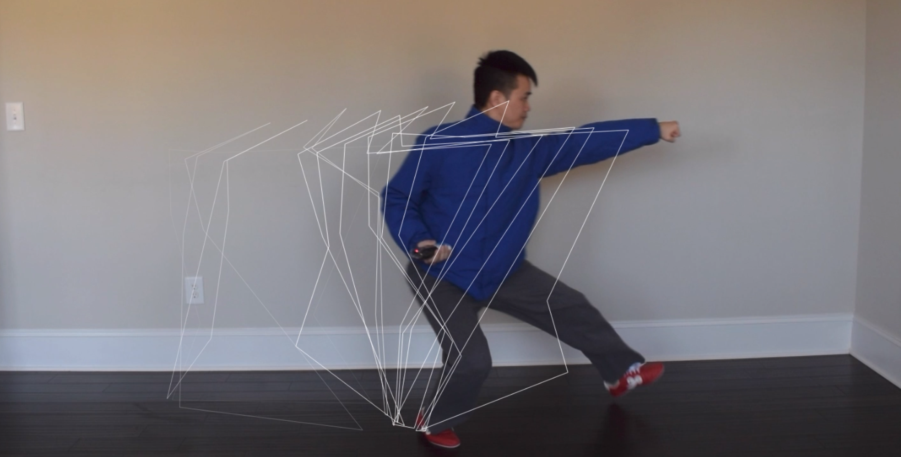
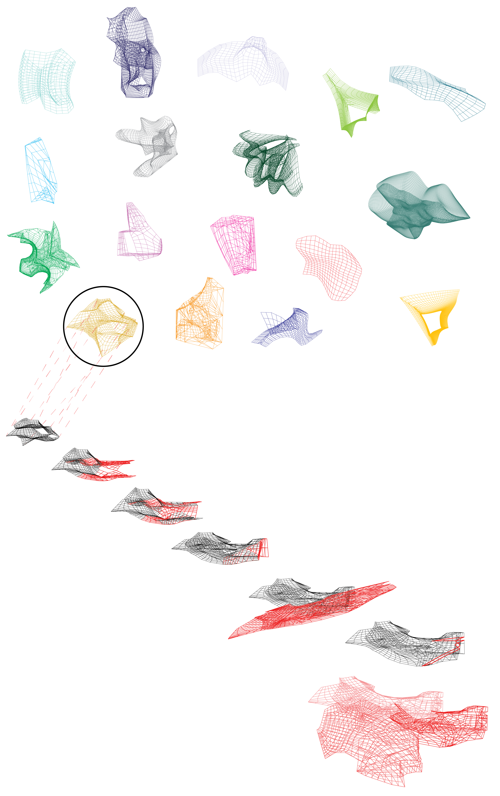

# 3x3punch
Parametric geometry generated from [wushu](https://www.youtube.com/watch?v=8AHHY-N0QPs) movements. A full demo of the various geometry generations can be found [here](https://vimeo.com/316207503).

# 1_point
Visualizations generated using WeMOS D1 mini with IMU/Accelerometer and Processing code. Based on Cedric Honnet's [ITP Camp workshop](https://github.com/honnet/ITP) on wireless sensors.

WeMos board with cellphone battery

# 2_body
Visualization generated using PoseNet via ml5.js.

# 3_spirit
Geometry made using randomly generated forms, in attempt to create a new formal language of occupiable space based around the intent/spirit of martial arts movements.

Form pieces were first generated in 3DS Max, then stitched and manipulated in Rhino 3D.

# Technical References

Cedric Honnet's 2018 [ITP Camp workshop](https://github.com/honnet/ITP) on wireless sensors was so incredibly helpful to this project that it deserves a second mention in this readme.

MPU6050 Arduino IDE function/method reference:
http://robojax.com/learn/arduino/?vid=robojax-mpu6050-LCD2004-I2C

PoseNet via ml5.js: https://ml5js.org/docs/posenet-webcam

Useful reference on OBJ files: http://paulbourke.net/dataformats/obj/
